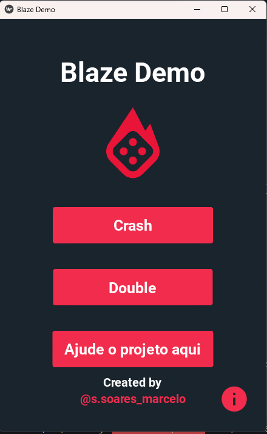
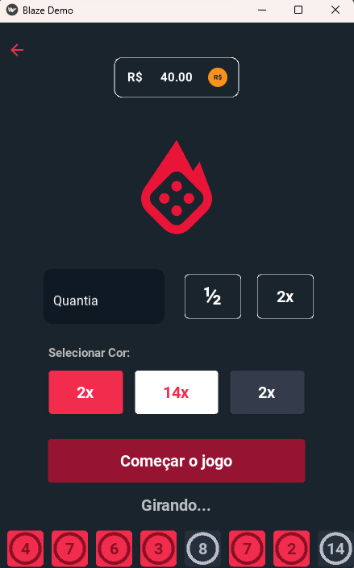
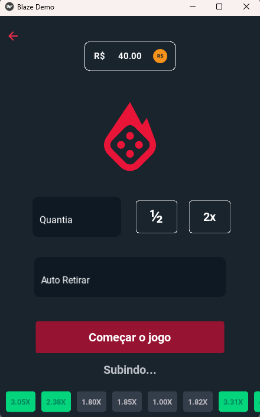

# Blaze-Demo

## Requisitos
- Python 3.8
- Biblioteca `kivy==1.11.1`
- Biblioteca `kivymd==0.104.1` (extensão do kivy)
- Biblioteca `webbrowser==0.10.2`

## Instalação
1. Instale o Python 3.8 (se ainda não tiver instalado).
2. Instale as bibliotecas necessárias usando o gerenciador de pacotes `pip`:
    pip install -r requirements.txt

## Uso
Execute o código-fonte:
    python main.py.

## Pagina inicial

## Pagina modo double

## Pagina modo crash

